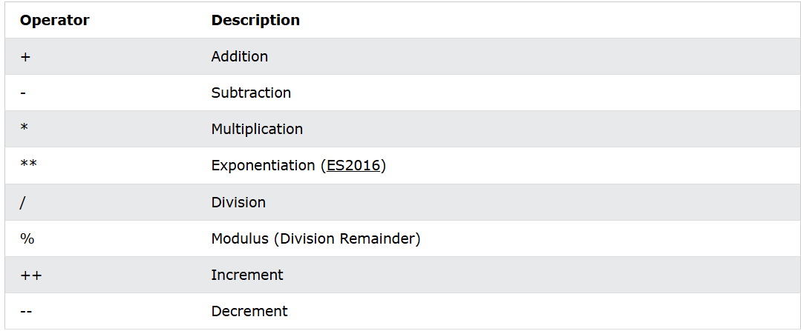
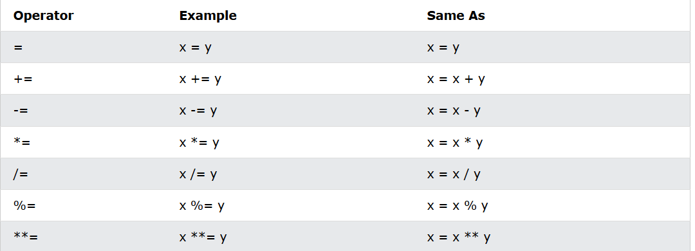
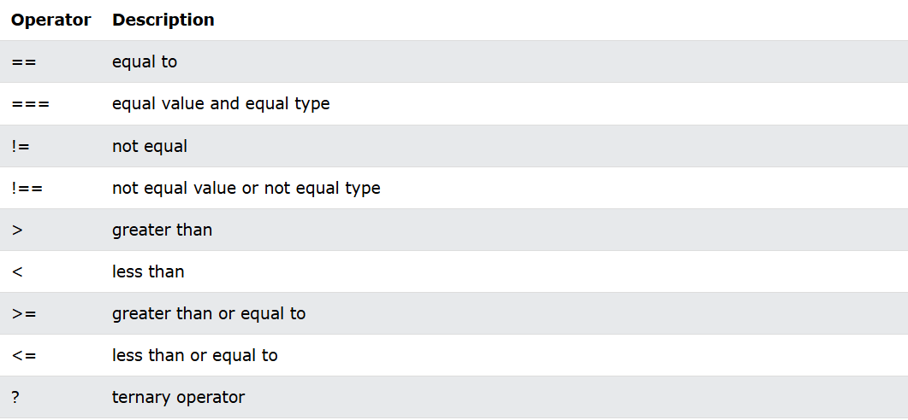

# Тема урока: 
- тэг <noscript>
- операторы сравнения
- операторы отношений 
- typeof
- фукции
- - Синтаксис объявления функции.
- - Параметры функции.
- - Возвращаемое значение функции. Ключевое слово return.
- - Область видимости переменной.
- - Использование rest и spread аргументов.
- - 2 вида определения функций:
- - function declaration;
- - function expression.
- - Создание функций в стиле function expression.
- - Стрелочные функции.
- - Объект arguments:
- - Цель и задачи объекта;
- - Свойство length.
- - Рекурсия.
- - Замыкания.


# Тэг <noscript>: 

-Тэг <noscript> используется для отображения контента, когда JavaScript отключен в браузере пользователя. Данный тег позволяет разработчикам предоставлять альтернативный контент, который будет виден пользователям, если их браузер не поддерживает JavaScript или если JavaScript отключен. Это может быть полезно для обеспечения доступности сайта и предоставления информации пользователям, которые не могут использовать JavaScript по каким-либо причинам. Но он сейчас уже не актуален, так как все браузеры поддерживают JavaScript. Вот пример использования тега <noscript>:

```html

<!DOCTYPE html>
<html lang="en">
<head>
    <meta charset="UTF-8">
    <meta name="viewport" content="width=device-width, initial-scale=1.0">
    <title>Document</title>
</head>
<body>
    <h1>Welcome to my website</h1>
    <p>This is a sample webpage.</p>
    
    <noscript>
        <div style="color: red;">
            JavaScript is disabled in your browser. Some features may not work properly.
        </div>
    </noscript>

    <script>
        // JavaScript code goes here
        console.log("JavaScript is enabled!");
    </script>
</body>
</html>
```

Данное сообщение могло выходить некоторым людяи во время `Windows XP` и `Windows 7`, когда браузеры не поддерживали JavaScript. Но сейчас это уже не актуально, так как все браузеры поддерживают JavaScript.


# Операторы
Нет смысла писать все с нуля так что сравним все операторы с `C#` и `JavaScript`. 
```javascript
// Операторы сравнения в JavaScript
// 1. Равенство (==) и строгое равенство (===)
console.log(5 == '5'); // true (нестрогое равенство, приводит к одному типу)
console.log(5 === '5'); // false (строгое равенство, не приводит к одному типу)
// 2. Неравенство (!=) и строгое неравенство (!==)
console.log(5 != '5'); // false (нестрогое неравенство, приводит к одному типу)
console.log(5 !== '5'); // true (строгое неравенство, не приводит к одному типу)
```
#### Арифметические операторы


#### Операторы присвоения 



#### Логические операторы


 

# typeof

- `typeof` - оператор, который возвращает строку, указывающую тип операнда. Он может быть использован для проверки типа переменной или значения. Например:
```javascript
let number = 42;
let string = "Hello, world!";

let isNumber = typeof number; // "number"
let isString = typeof string; // "string"
let isObject = typeof null; // "object" (это известная особенность JavaScript)
let isFunction = typeof function() {}; // "function"
```

# Функции

Функции в JavaScript - это объекты первого класса, что означает, что они могут быть переданы как аргументы, возвращены из других функций и присвоены переменным. в `js` фукции являются объектами, так что у них можно забрать тип. 

**Синтаксис объявления функции:**
```javascript
function functionName(parameters) {
    // тело функции
}
```

**Параметры функции:**
- Параметры функции - это переменные, которые передаются в функцию при ее вызове. Они могут быть обязательными или необязательными. Например:
```javascript
function add(a, b) {
    return a + b;
}
console.log(add(2, 3)); // 5

console.log(add(2)); // NaN (второй параметр не передан)

function add(a, b = 0) {
    return a + b;
}
console.log(add(2)); // 2 (второй параметр по умолчанию равен 0)
```
Из прикольного тут есть такая фишка, учитывая что функция это объект, то передаваемые нами параметры должгы записываться в какое-то поле и это так. По умолчанию это записывается в `arguments`
```javascript
function add() {
    console.log(arguments);
 
}
```

## Возвращаемое значение функции. Ключевое слово return.

- Ключевое слово `return` используется для возврата значения из функции. Если функция не возвращает значение, то по умолчанию она возвращает `undefined`. Например:
```javascript
function multiply(a, b) {
    return a * b;
}

console.log(multiply(2, 3)); // 6

function greet(name) {
    console.log("Hello, " + name);
}

greet("Alice"); // "Hello, Alice"

let result = greet("Bob"); 
console.log(result); // undefined
```

можно возвращать сразу несколько значений, но только в виде массива или объекта. 
```javascript
function getCoordinates() {
    // return [10, 20];
    return {a: 10, b: 20};
}

console.log(getCoordinates());
```

## Область видимости переменной.

- Область видимости переменной определяет, где эта переменная доступна в коде. В JavaScript есть три основных области видимости:
  - Глобальная область видимости: переменные, объявленные вне функций, доступны везде.
  - Локальная область видимости: переменные, объявленные внутри функции, доступны только внутри этой функции.
  - Блочная область видимости: переменные, объявленные с помощью `let` или `const` внутри блока (например, внутри фигурных скобок), доступны только в этом блоке.

```javascript
let a = 5; // global variable

function add(b) {

    let c = 5; // local variable

    function inner() {
        if (true) {
            let d = 10; // block-scoped variable
            console.log(a + b + c + d);
        }
    }

    return a + b;
}

if (true) {
    let e = 15; // block-scoped variable
    console.log(a + e);
}

console.log(add(3));

```

## Использование rest и spread аргументов.

- `rest` и `spread` - это синтаксические конструкции, которые позволяют работать с массивами и объектами более удобно.

- `rest` оператор позволяет собирать оставшиеся аргументы функции в массив. Он используется в определении функции. Например:
```javascript
function sum(...numbers) {
    let total = 0;
    for (let number of numbers) {
        total += number;
    }
    return total;
}

console.log(sum(1, 2, 3, 4, 5)); // 15
```

- `spread` оператор позволяет развернуть массив или объект в отдельные элементы. Он используется при вызове функции или при создании нового массива/объекта. Например:
```javascript

let numbers = [1, 2, 3];
let moreNumbers = [4, 5, 6];

let allNumbers = [...numbers, ...moreNumbers];
console.log(allNumbers); // [1, 2, 3, 4, 5, 6]

```

- `spread` оператор также может быть использован для копирования объектов:
```javascript
let person = { name: "Alice", age: 25 };
let copyPerson = { ...person };
console.log(copyPerson); // { name: "Alice", age: 25 }
```

- `rest` и `spread` операторы могут быть использованы вместе:
```javascript
function multiply(multiplier, ...numbers) {
    return numbers.map(number => number * multiplier);
}

console.log(multiply(2, 1, 2, 3)); // [2, 4, 6]
```

# 2 вида определения функций:
- `function declaration` - это обычное объявление функции. Например:
```javascript
function greet(name) {
    return "Hello, " + name;
}
```
- `function expression` - это определение функции как выражения. Например:
```javascript
const greet = function(name) {
    return "Hello, " + name;
};

console.log(greet("Alice")); // "Hello, Alice"
```

Можно было бы использовать и `let`, но дело в том что тогда мы бы могли изменить значение переменной `greet` на что-то другое, а это не совсем то что мы хотим. 

- Стрелочные функции - это сокращенный синтаксис для определения функций. Они не имеют своего контекста `this`, что делает их удобными для использования в методах массивов и других местах, где контекст `this` может быть потерян. Про потерю this мы поговорим позже когда будем разбирать `class`. 

Пример стрелочной функции:
```javascript
const add = (a, b) => a + b;
console.log(add(2, 3)); // 5
```

# Closure или Замыкания

- Замыкание - это функция, которая имеет доступ к своей внешней функции (scope) даже после того, как внешняя функция завершила выполнение. Это позволяет сохранять состояние и создавать приватные переменные. В Javascript замыкания это часть асинхронного программирования. 

```javascript
function outerFunction() {
    let outerVariable = "I am outside!";

    function innerFunction() {
        console.log(outerVariable);
    }

    return innerFunction;
}

const closure = outerFunction();
closure(); // "I am outside!"


```
- В этом примере `innerFunction` имеет доступ к переменной `outerVariable`, даже после того, как `outerFunction` завершила выполнение. Это и есть замыкание.
- Замыкания часто используются для создания приватных переменных и методов. Например:
```javascript
function createCounter() {
    let count = 0;

    return {
        increment: function() {
            count++;
            return count;
        },
        decrement: function() {
            count--;
            return count;
        },
        getCount: function() {
            return count;
        }
    };
}
const counter = createCounter();

console.log(counter.increment()); // 1
console.log(counter.increment()); // 2
console.log(counter.decrement()); // 1
```
