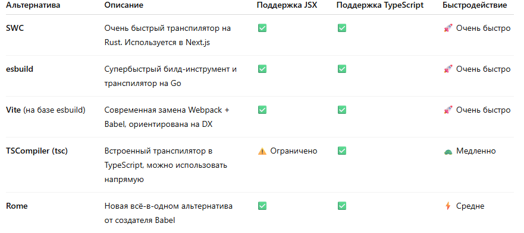

# Тема урока: 
- Babel в Javascript 
- Функциональные компоненты 
- Хуки в React 

# [Babel в Javascript](https://babeljs.io/) 

`Babel` - это компилятор для JS, который позволяет адаптировать новую версию языка для старых библиотек и наоборот. Так как `JS` - это очень широкий язык, в нем есть множество библиотек, между которыми нужно реализовать совместимость. Конечно же этих знаний недостаточно для того чтобы понять полноценно как он работает и зачем он нам нужен. Давайте копнем глубже. 

****

1. Можем ли мы обойтись без Babel при разработки на React ? 
Ответ да, есть подобные библиотеки, которые могут сделать замену
2. Как работает Babel ? 
Он дает нам возможность того, чтобы код написанный по стандарту ES6+ был доступен для кода на стандарте ES5. Как я сказал выше это нужно для того чтобы некоторые библиотеки работали корректно. 
3. Какова роль Babel в JSX ? 

После этого мы с вами будем использовать [Vite](https://vite.dev/guide/), для трансляции JSX. 

# Хуки в React 

Так как функциональные и классовые компоненты - это по своей сути абсолютно разные подходы в написании компонентов, то и логика их работы тоже другая. Как мы с вами прошли на прошлом уроке, в классовых компонентах есть ряд методов для обеспечения кправления состоянием компонента. В функциональных компонентах такого из под капота не существует, соответсвенно наряду с синтаксисом написения компонента мы должны выучить ряд методов, которые называются хуками. 

- useState
- useEffect 
- useRef 
- useContext 
- useMemo
- useReducer
- useCallback 

конечно же мы можем писать и кастомные хуки, но это мы будем делать сильно позже. 

Все примеры с этими хукам будут в проекте func-components 

### useState

Так как у нас нет объекта this.state, который мы должны менять, то наши хук useState просит `UI` обновить тот элемент который изменился. 

### useEffect 
Этот хук заменяет componentDidMount и componentWillUpdate. Он триггерится на любое изменние в компоненте или же мы моежем дать ему массив dependecies для того чтобы вызывать его только при обновлении конктреных элементов. 

